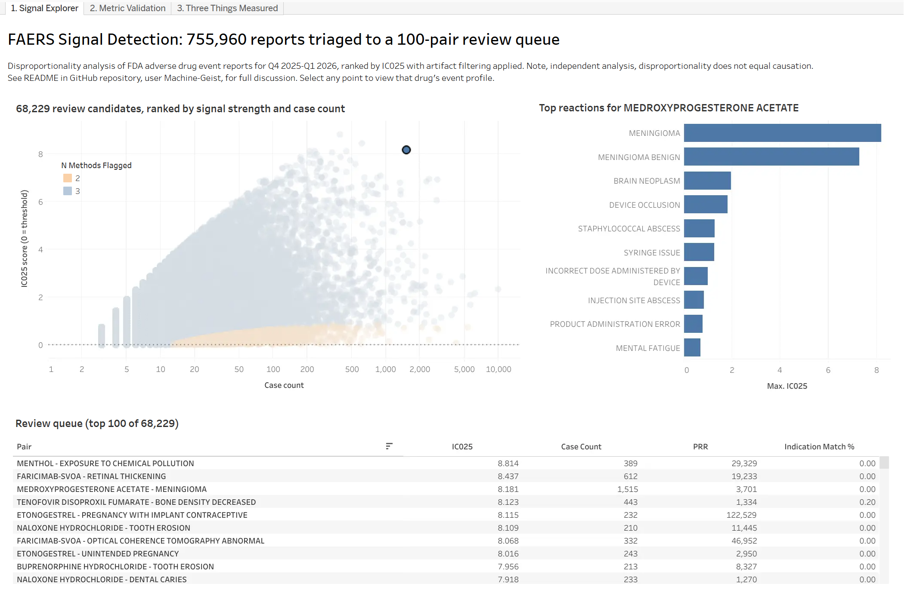
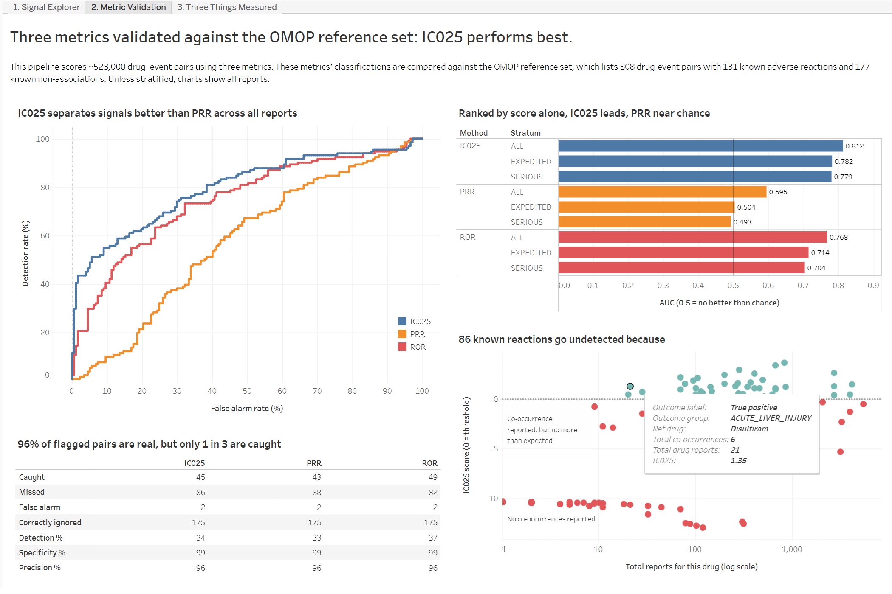
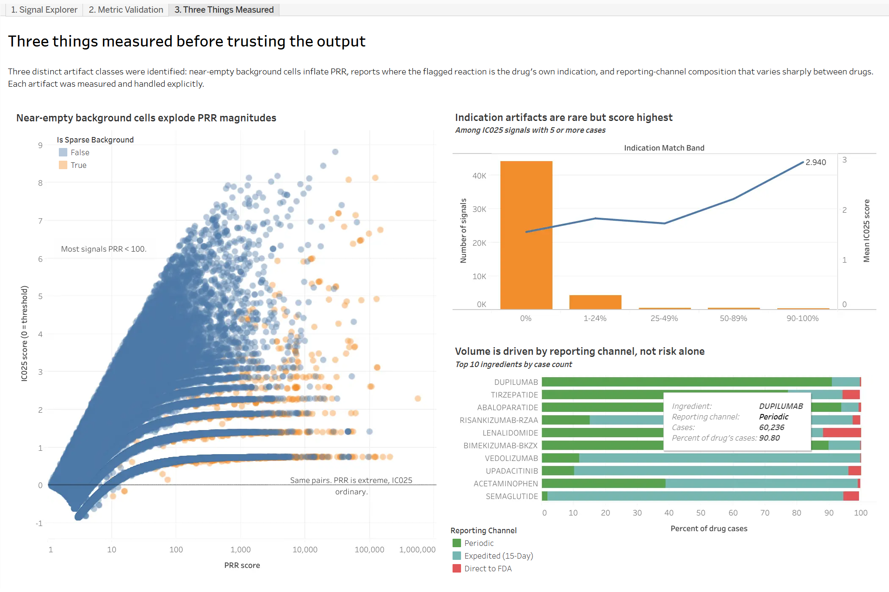

# FAERS Adverse Event Signal Detection

Turning 755,960 FDA adverse event reports into a ranked review queue — and
measuring whether the ranking actually works.

**[View the interactive dashboard →](https://public.tableau.com/app/profile/nathan.mcwain/viz/FAERSAdverseEventSignalDetection/1_SignalExplorer#2)**



---

## The problem

The FDA's Adverse Event Reporting System (FAERS) collects reports of suspected
drug side effects — submitted voluntarily by doctors, patients, and
manufacturers. Millions of them. Nobody verifies that the drug caused the event;
someone simply reported that both occurred.

Finding real safety signals in that pile is a statistical problem called
**disproportionality analysis**: is this drug-reaction pair reported more often
than you'd expect, given how often that drug and that reaction each appear
overall? It's the standard first-pass tool in pharmacovigilance.

The trouble is that it flags far too much. Two quarters of FAERS data produce
**527,841 candidate drug-event pairs**, of which **70,728** cross a signal
threshold. No safety team can review 70,000 pairs.

So the real deliverable isn't a list of signals. It's a **prioritised worklist** —
the pairs most worth a someone's time this quarter, with known false-alarm
patterns already stripped out, and with the ranking measured against known
answers rather than assumed to work.

That last part is what most disproportionality projects skip, and it's most of
what this one is about.

---

## Results

| | |
|---|---|
| Cases analysed, deduplicated | 755,960 |
| Drug-event pairs evaluated | 527,841 |
| Pairs crossing the IC025 threshold | 70,728 |
| Review candidates after artifact filtering | **68,229** |
| | |
| **Ranking quality — raw score, no companion criteria (AUC)** | |
| IC025 | **0.812** |
| ROR | 0.768 |
| PRR | 0.595 |
| | |
| Precision at the default threshold | 96% |
| Sensitivity | 34% |

AUC measures how well a score orders known-real signals above known-false ones.
0.5 is a coin flip.

---

## Three metrics, and why the choice matters

Each drug-reaction pair produces a 2×2 table: how often the drug and reaction
appear together, how often each appears without the other, and how big the
database is. Three standard measures are computed from it.

| Metric | What it is | Signal criterion |
|---|---|---|
| **PRR** | Proportional Reporting Ratio — a plain ratio of observed to expected | ≥ 2, chi-square ≥ 4, ≥ 3 cases (Evans' criteria) |
| **ROR** | Reporting Odds Ratio, with a 95% confidence interval | CI lower bound > 1, ≥ 3 cases |
| **IC025** | Information Component, a Bayesian measure used by WHO's Uppsala Monitoring Centre. Shrinks toward zero when evidence is thin | > 0, no case-count floor |

All three are computed on every pair, because **the comparison is the finding.**

### Raw PRR cannot be ranked

A ratio has no ceiling. When a reaction is essentially unique to one drug, the
denominator approaches zero and PRR explodes. Measured across signals with no
empty cell: median 11, but the 99.9th percentile is 15,660 and the maximum
566,964.

Five orders of magnitude carrying no interpretive information. A PRR of 100 and
a PRR of 500,000 mean the same thing in practice — "extreme, and driven by a
near-empty background." Sort by it and sparse noise floats to the top. That's
why raw PRR scores 0.595 as a ranking statistic.

**This is not a verdict on PRR as a method.** Applied as Evans intended — with
the chi-square test and 3-case minimum attached — it classifies about as well as
IC025: 43 caught against 45, the same 2 false alarms, the same 96% precision.
The limitation is specific and it matters here because a triage queue *is* a
ranking, and Evans' criteria give a yes/no answer rather than an order. IC025
needs no companion criteria because the shrinkage is built into the score
itself.

### What actually separates the methods

The obvious explanation would be that IC025 wins because it quantifies
uncertainty. Measurement says otherwise:

| Case count | Pairs | PRR flags | ROR flags | IC025 flags |
|---|---|---|---|---|
| 1–10 | 490,005 | 61,334 | 60,934 | 44,932 |
| 11–20 | 19,431 | 11,807 | 12,767 | 11,993 |
| 100+ | 2,624 | 1,909 | 2,256 | 2,238 |

ROR carries a proper confidence interval and still flags within 1% of PRR in the
sparse region. What distinguishes IC025 is **how hard it penalizes** thin
evidence — and note that it isn't uniformly stricter. Below 10 cases it flags
37% fewer pairs than PRR; above 10 cases it flags *more*, at every count. The
Bayesian penalty moves sensitivity out of the region where one extra report
swings the answer and into the region where the data can carry it.

Yet ROR ranks at 0.768 while PRR ranks at 0.595, on nearly identical flags.
Those coexist because **thresholding and ranking are different problems**: AUC
measures ordering, and ROR's confidence bound is a well-behaved ordering
statistic while the raw ratio is not.

---

## Does it work?



Signals were scored against the **OMOP reference set** (Ryan et al., *Drug
Safety* 2013) — 399 drug-outcome pairs where the answer is already known from
the literature, split into positive controls (the drug does cause the outcome)
and negative controls (it doesn't). 308 mapped to this data: 131 known
reactions, 177 known non-associations.

At the default IC025 threshold:

| | |
|---|---|
| Caught | 45 |
| Missed | 86 |
| False alarms | 2 |
| Correctly ignored | 175 |
| **Precision** | **96%** |
| Sensitivity | 34% |

**Highly specific, deliberately insensitive.** Two thirds of known positives are
missed — but reviewer time is the scarce resource, and a queue that's 96% real
is usable where a queue at 50% is not. The pipeline is a filter, not a detector.

### Why 86 were missed

Sensitivity is mostly bounded by what's in the data rather than by the method:

- **50 of 86 have zero co-occurrences.** The drug and the reaction never appear
  together anywhere in these two quarters. No method at any threshold can detect
  a pair that isn't in the data.
- **36 were reported together but no more than expected.** Some of these are
  genuinely high-volume drugs whose signal is diluted across a large existing
  reaction profile — clozapine has 23 liver-injury co-occurrences across 3,214
  reports and still scores IC025 −2.28; infliximab has 107 across 5,388. That
  dilution is a real property of disproportionality, not an implementation flaw.

Both categories would shrink with more quarters loaded, the first far more than
the second.

### The two false alarms

Darbepoetin alfa and entecavir, both flagged for acute kidney injury. Neither
appears to be a failure of the math. Both are drugs given to patients who
already have kidney disease — darbepoetin alfa treats anaemia of chronic kidney
disease, and entecavir requires renal dose adjustment, so renal function is
routinely monitored and documented in that population.

**This reading is clinical inference, not a measured result.** What can be shown
is that the artifact filter doesn't catch them: it requires the indication and
the reaction to be coded as the same MedDRA term, and here they aren't —
`CHRONIC KIDNEY DISEASE` against `RENAL IMPAIRMENT`. Similar clinical situation,
different codes, no match.

### Two hypotheses tested and disconfirmed

**Stratification didn't help.** Restricting to expedited reports — the 15-day
filings legally required for serious, unexpected events — should in principle
sharpen the signal by excluding the routine periodic channel. On an identical
set of 114 positives and 147 negatives, AUC *fell*: 0.812 → 0.782 (expedited)
and 0.779 (serious). The lost sample size outweighs the gain in report quality.

**Masking didn't matter either.** One drug accounts for ~7.8% of all
primary-suspect cases, which in theory suppresses signals for everything else by
inflating the background. Excluding it moved AUC by 0.001, and left the
reference drug and pair counts completely unchanged.

Both strata stay in the pipeline. The negative results are part of the finding.

---

## Three artifact classes, measured and handled



Ranking by raw disproportionality surfaces things that aren't adverse reactions
at all:

| Pair | What it actually is |
|---|---|
| Trientine → urine copper increased | the drug's intended effect |
| Rho(D) immune globulin → Rhesus antibodies positive | its mechanism of action |
| Tuberculin → false positive TB test | the product's entire purpose |
| Omaveloxolone → Friedreich's ataxia | the condition being treated |

Each class was measured, and each produced a specific change to the pipeline.

### Near-empty backgrounds

When almost nothing *else* in the database reports a reaction, the ratio
explodes. Tuberculin → false positive TB test scores PRR 130,830,231. IC025 on
the same pair: 3.107.

**Testing for an empty cell isn't enough.** Etonogestrel → pregnancy with
implant contraceptive has no empty cell — two other drugs report it — and still
reaches PRR 122,529.

**What was done:** a `background_count` column exposing that number directly,
and an `is_sparse_background` flag at fewer than 5 background cases, which
marks three times as many pairs as an empty-cell test alone. Both are carried
through to the dashboard so a reviewer can see immediately whether a signal
rests on a near-empty comparison.

The review queue itself excludes pairs where one of the comparison cells is
genuinely empty, but does not exclude sparse-but-nonzero ones. That's
deliberate: IC025 already penalises thin evidence through its shrinkage term,
so a second filter on the same problem would remove pairs the score has
already accounted for — and the etonogestrel signal, sparse background and
all, is a real contraceptive failure worth a reviewer's attention. The flag
exists to inform the reviewer, not to decide for them.

### Confounding by indication

Lack of efficacy is a legally reportable event. When a drug fails to control the
condition it treats, a report is filed with that condition coded as the
reaction — and the contingency table looks identical to a genuine adverse
reaction.

**What was done:** every pair carries the share of its cases where the flagged
reaction is also the drug's documented indication, and pairs above **25%** are
flagged as likely artifacts and excluded from the review queue. That threshold
is a documented judgment call, not a discovered one — the distribution decays
smoothly with no natural break. 25% was chosen because a genuine reaction should
have near-zero overlap, and it catches near-misses that a 50% cut would let
through: lanadelumab / hereditary angioedema sits at 49.7%. 2,307 of 70,728
signals (3.3%) are flagged.

**Residual confounding remains, and it's a lower bound.** The match requires the
indication and reaction to be the *same* MedDRA term. Antihemophilic factor →
haemarthrosis reads 3%, because joint bleeding in a haemophilia patient is coded
`HAEMARTHROSIS` while the indication is coded `HAEMOPHILIA A`. Different terms,
same clinical fact. Closing that gap needs the MedDRA hierarchy, which is
licensed.

### Reporting channel composition

Volume is not risk. One drug's reports are 91% periodic filings, against
acetaminophen's 61% expedited — consistent with solicited reporting through a
manufacturer patient-support programme rather than a difference in safety.

**What was done:** a stratum excluding the highest-volume drug entirely, to test
whether it was suppressing signals for everything else. It wasn't — AUC moved
0.001. Reported as a measured non-finding rather than dropped.

---

## Signals it found

**Medroxyprogesterone acetate → meningioma.** 1,515 cases, IC025 8.18, third in
the ranked queue, zero indication contamination. A genuine and recently
characterised association, surfaced with no domain knowledge fed into the
pipeline.

**Tenofovir disoproxil → decreased bone density.** IC025 8.12 — and this one
nearly didn't survive the build.

Mapping the reference set's drug names onto FAERS needs a rule, because FAERS
records salt forms while the benchmark names the active ingredient. A prefix
match resolved 45 of 46 multi-form drugs correctly. On the 46th it merged
tenofovir alafenamide (TAF) with tenofovir disoproxil (TDF) — reasonable on the
strings, wrong on the pharmacology. TAF exists *specifically because* TDF causes
bone and renal toxicity; that difference is the entire clinical rationale for
the newer drug. Merging would have diluted the signal into nothing.

The two findings support each other. The bone-density signal is a known,
well-documented property of TDF, and the pipeline surfaced it independently with
no prior knowledge supplied — evidence that the ranking finds real things.
Conversely, having that signal already visible is what made the bad merge
detectable: the number moved when it shouldn't have. Automated matching plus
domain review caught what neither would have caught alone.

---

## How it's built

```
raw          faithful landing tables — 7 FAERS files, no cleaning
  ↓
staging      types, blank→NULL, deduplication, ingredient normalization
  ↓
marts        analysis universe, contingency counts, three metrics
  ↓
validation   the same math at reference-set grain, scored against ground truth
  ↓
exports      flat CSVs for Tableau
```

Three design decisions do most of the work:

**Deduplicate to the latest case version.** FAERS ships one row per case
*version* — a report amended three times appears three times. Counting without
collapsing inflates everything downstream. An early version of the ingredient
mapping missed this and produced 27,783 spurious rows with nothing erroring,
which is why every materialized view now carries a `UNIQUE` index on its stated
grain as an assertion.

**Define the analysis universe once.** A case counts only if it has both a
primary-suspect drug and a reaction. Every mart inherits that definition, so all
four cells of every contingency table come from the same population.

**Score the benchmark the way the benchmark is written.** The reference set says
"amlodipine causes acute liver injury" — one drug, one condition. FAERS is far
more granular: amlodipine appears under four different salt names, and "acute
liver injury" covers eight different MedDRA terms. That's up to 32 separate rows
describing one reference pair. Scoring each row and keeping the best would mean
running 32 tests and reporting the winner — every known non-association would
get 32 chances to look like a signal, and specificity would collapse for reasons
having nothing to do with the method. Instead all 32 are combined into a single
count first, and the statistics are computed once.

**Stack:** PostgreSQL, DBeaver, Python (one script), Tableau Public.

---

## Limitations

The short version — full treatment in [`docs/limitations.md`](docs/limitations.md).

- **Disproportionality is not causation.** It measures reporting patterns. The
  output is a review queue, not a set of conclusions.
- **No exposure denominator.** FAERS records reports, not patients, so no rate
  can be computed. Both validation false alarms trace directly to this.
- **Two quarters only.** No time-series or emerging-signal detection.
- **Salt and ester forms are unresolved** — 332 variants, 7.1% of primary-suspect
  records. Measured, documented, and left in place; reliable merging needs
  RxNorm active-moiety mapping.
- **Indication matching is a lower bound.** It requires identical MedDRA coding,
  so it misses the more common case where the reaction is a *manifestation* of
  the indication.
- **No MedDRA licence.** Outcome groupings are hand-built rather than
  Standardised MedDRA Queries. Four separate limitations trace to this.
- **The benchmark has known problems.** ~17% of the OMOP negative controls are
  documented as possibly misclassified (Hauben et al., 2016), so 0.812 is more
  likely an underestimate than an overestimate.

---

## Running it

**Prerequisites:** PostgreSQL 14+, DBeaver, Python 3.9+, ~10 GB disk.

```
1. sql/00_setup/      create tables, load FAERS files, retrieve OMOP reference set
2. sql/01_staging/    clean and deduplicate
3. sql/02_marts/      build contingency tables and compute metrics
4. sql/03_validation/ score against the reference set
5. sql/05_qc/         run assertions — checks 1-9 must pass
6. sql/04_exports/    export ten CSVs for Tableau
```

Every section has its own README. Start at
[`sql/00_setup/README.md`](sql/00_setup/README.md).

---

## Repository

```
faers-signal-detection/
├── data/      exported CSVs behind the dashboard, with a README
├── docs/      decisions.md — every judgment call and its rationale
│              limitations.md — every documented weakness
├── images/    dashboard screenshots
└── sql/       00_setup → 05_qc, six sections, each with a README
```

Two documents are worth reading beyond the code.
[`docs/decisions.md`](docs/decisions.md) records every judgment call, and the
times measurement overturned an assumption I started from.
[`docs/limitations.md`](docs/limitations.md) records what this output cannot
support.

---

## Data sources

- **FAERS** quarterly files, 2025Q4–2026Q1 —
  [FDA download](https://fis.fda.gov/extensions/FPD-QDE-FAERS/FPD-QDE-FAERS.html).
  Public domain (CC0 1.0).
- **OMOP reference set** — distributed in OHDSI's
  [MethodEvaluation](https://github.com/OHDSI/MethodEvaluation) R package.

Source data is not committed. See [`data/README.md`](data/README.md).

---

## Disclaimer

Independent analysis, not affiliated with or endorsed by the FDA.
Disproportionality signals indicate that a drug-reaction pair is reported more
often than expected relative to the rest of the database — **they do not
establish causation.** FAERS reports are voluntary and unverified, contain
duplicates, and have no exposure denominator. Nothing here is medical advice.

## AI assistance

Built with AI assistance for SQL implementation and methodological guidance.
Analysis decisions, validation, and interpretation are my own — and as
[`docs/decisions.md`](docs/decisions.md) records, measurement overturned that
guidance on several occasions.
